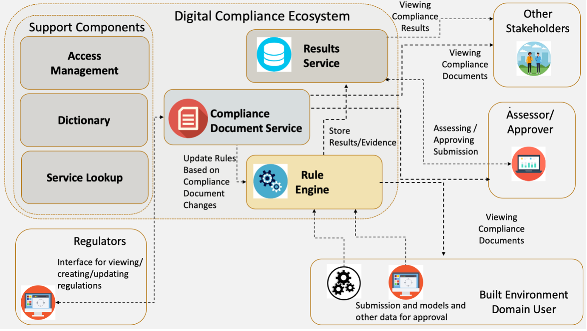

## Compliance Ecosystem Architecture

The overall architecture of the digital compliance ecosystem is shown below.

Each component of this architecture will now be defined formally:

1. **Compliance Document Service**: A Software Service that provides the storage, retrieval, querying updating, and management of Digitised Compliance Documents stored in a machine-readable format each of which applies within a given jurisdiction(s).
2. **Results Service**: A Software Service that provides the storage, retrieval and management of results of Compliance Checking.
3. **Rule Engine**: A Software Service that provides a Compliance Checking engine. Is able to execute a compliance check against a given Compliance Document by receiving and retrieving data from a set of sources (including BIM model data).
4. **Access Management Service**: A Software Service that provides authentication and authorisation services for other components of the Compliance Ecosystem. The philosophy behind this component is described in Section 3.3.
5. **Service Lookup**: A Software Service that provides a directory of other services within the Compliance Ecosystem.
6. **Dictionary**: A Software Service that provides the ability to translate between the differing semantics of Compliance Documents, including the ability to translate the terms that are commonly used inconsistently across languages and technical domains.  Additionally, it will provide the translations between human readable terms and machine-readable terms (i.e., data models lookup).

In addition to the components of Compliance Ecosystem that have been described above - there is a set of external components that are not part of the ecosystem nor controlled by it, but their services are required in order to produce compliance checking results These tools sit outside of the Compliance Ecosystem and may well be either free, or commercial tools. 

These include:

1.	**Compliance Simulation and Analytical Tools**: A tool (i.e., energy analysis) that performs a specialised task, but whose result data is required as part of the Compliance Checking process.
2.	**Asset Model Source**: A service that can provide asset model data (i.e., BIM). Examples of this could include a model server, or a common data environment.
3.	**Other Data Sources**:  Other Data Sources that can provide other types of data (such as product data and geolocation data) to contribute towards the Compliance Checking process. 
