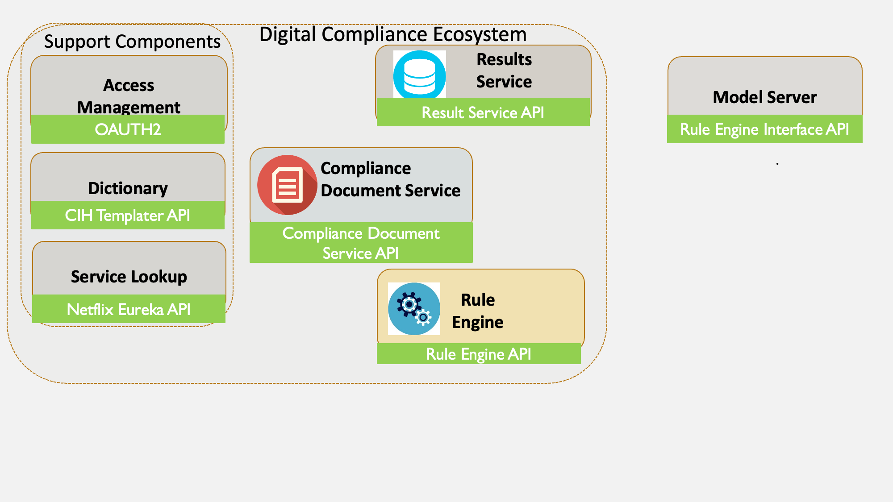

## Compliance Ecosystem APIs

This section will define the APIs used by the digital compliance ecosystem. In total four custom APIs will be developed:

1. Compliance Document Service API
2. Result Service API
3. Rule Engine API
4. Rule Engine Interface API

Additionally, four pre-existing APIs will be utilised based on our re-use of existing software components:

1. CIH Templater API - API <a href="https://docs.dcom.org.uk/resources/templater" target="_blank">[here]</a>
2. OAUTH2 - API <a href="https://oauth.net/2/" target="_blank">[here]</a>
3. OpenIDConnect - API <a href="https://openid.net/connect/" target="_blank">[here]</a>
4. Netflix Eureka Service Discovery API - API <a href="https://github.com/Netflix/eureka/wiki/Eureka-REST-operations" target="_blank">[here]</a>

The APIs relationships to the ecosystem components are shown below.

This remainder of this page specifies the CUSTOM APIs for the Digital Compliance Ecosystem. For specific endpoint information related to the pilot deployment please see [here](pilot.md)

###Compliance Document Server

1. <a href="https://docs.dcom.org.uk/resources/compliancedocumentserver" target="_blank">[API Specification]</a> 

###Results Service

1. <a href="https://docs.dcom.org.uk/resources/resultserver" target="_blank">[API Specification]</a>

### Rule Engine

1. The Rule Engine <a href="https://docs.dcom.org.uk/resources/ruleengine" target="_blank">[API Specification]</a>
2. The Rule Engine Interface - which should be implemented by all services that the rule engine can connect to - <a href="https://docs.dcom.org.uk/resources/ruleengineinterface" target="_blank">[API Specification]</a>
